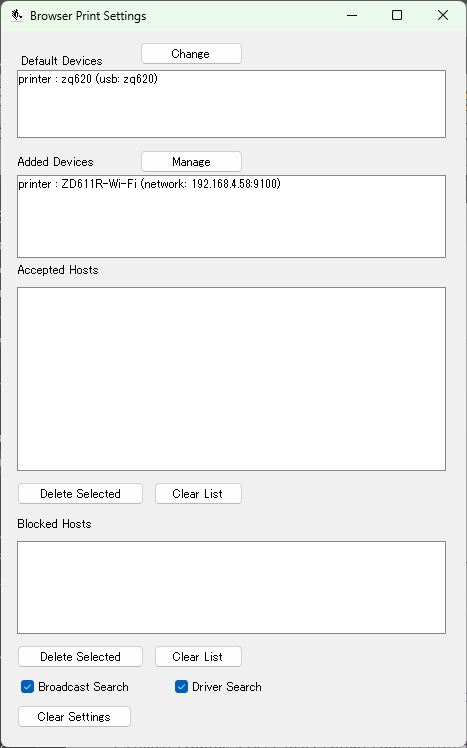

# Zebra-Printer_Print DNA Tools can Make Your Printing Process Easier
# 意外と知られていない。便利なZebra Print DNAの印刷ツール比較。

Print DNA には企業ユース向けに便利で協力なツールが用意されています。本頁で印刷機能に関連したツールを紹介します。

#### Zebra Print DNA
https://www.zebra.com/jp/ja/software/printer-software.html
 

## 用途に合わせて選べる印刷ツール

印刷現場でちょっとしたラベルを印刷する処理を作成したい、お客様に向けて効果的なデモ処理を見せたいということがあるかと思います。その時にゼブラで推奨しているツールが下記の6つです。多くのツールがリリースされている中、違いが知りたいというお声を多くいただくようになったので、まとめてみました。
 

1. ZebraDesigner Professional
2. Zebra Print
3. Print Connect
4. Browser Print 
5. PDF Direct
6. Link-OS Multiplatform SDK

   

## 1. ZebraDesigner Professional for Windows

コストをかけずに汎用的なラベル印刷処理を実施したいという要望は比較的多いなか、ぴったりなソリューションがZebraDesiner Professional ソフトウェアになります。本ソフトウェアとプリンタをご用意いただくことで下記が実現できます。初心者に向けに設計されたU/Iのため、ラベル印刷ビギナーでも簡単に扱えるのもポイントです。

- スキャナで読み取ったデータを基にラベルを印刷
- Excel, CSV, データベースを基にラベルを印刷
- お好みのラベルをデザイン
- RFIDラベルへのエンコードも可能

 

### ■ ポイント

#### ・コスト、時間をかけずに汎用的な印刷処理環境を構築可能

### ■ 製品リンク

https://www.zebra.com/jp/ja/software/printer-software/zebradesigner.html
  

## 2. Zebra Print for Android

 

「現在Android上で表示されているラベルを印刷したい」「ラベル印刷処理の開発したくない」という要望を解決するために開発されたAndroidアプリになります。Android上で印刷ドライバのような働きをします。アプリをインストールすることにより、お使いのブラウザやPDFリーダなどから任意のデータを印刷することができます。自分で作成したPDFデータも印刷ができるので、デモ活動でも頻繁に用いられます。

### ■ ポイント

#### ・既存のアプリと連動が可能
#### ・ラベルの印刷処理を開発しなくてもよい
#### ・無償提供ツール

 

### ■ Zebra Print まとめ情報

https://github.com/shimauma-giken/Zebra-Printer_LInk-OS_What-is-Zebra-Print

### ■ 製品リンク

https://www.zebra.com/jp/ja/software/printer-software/zebra-print.html 

 
 

## 3. Print Connect for Android

自社開発したAndroidアプリに印刷機能を実装したいが、プリンタ処理の開発経験がないため不安という方に最適なアプリとなります。上記Zebra Print同様に印刷サービスとして動作をしますが、外部連携用のAPIが実装されています。そのため、開発したアプリから、API連携をする処理を記述するだけで印刷処理を完成させることができます。デモ用のサンプルアプリもダウンロードができるので、簡単なデモもできます。

### ■ ポイント

#### ・開発したアプリと連動が可能
#### ・ラベルの印刷処理を開発しなくてもよい
#### ・無償提供ツール

 

### ■ 製品リンク

https://www.zebra.com/jp/ja/software/printer-software/zebra-print.html 

 
 

## 4. Browser Print SDK for Multi-OS

マルチOS化が進む中、様々な企業向けアプリケーションがブラウザ化する傾向があります。そのため、印刷処理をブラウザ化したいという要望が多くなってきています。Browser Print はブラウザからプリンタに対して直接印刷指示をしたい方向けの開発ツールとなります。専用のアプリをインストールすることでローカル接続のプリンタに対しても印刷指示をすることができるようになります。デモ用のサンプルアプリもダウンロードができるので、簡単なデモもできます。

### ■ ポイント

#### ・ブラウザアプリから直性印刷が可能
#### ・マルチOS対応（Android, Windows, OSX, Linuxなど）
#### ・無償提供ツール

 

### ■ 製品リンク

https://www.zebra.com/jp/ja/software/printer-software/browser-print.html
 
 

## 5. PDF Direct for Link-OS Printer

企業向け基幹システムにおいてラベルを含むドキュメント管理フォーマットのPDF化が進んでいます。そのため、ラベル印刷処理においてもPDF化が急務となってきています。ゼブラ社のプリンタはPDFデータを印刷する機能が備わっているため、基幹システムのPDFを直接受け取って、高速に印刷することができます。多くの競合他社製品のようにPDFを印刷言語に変換するミドルウェアを用意する必要がありません。

### ■ ポイント

#### ・PDF変換用のミドルウェアが不要
#### ・オーバーヘッドがないため、高速に印刷
#### ・無償ライセンス

 

### ■ 製品リンク

https://www.zebra.com/jp/ja/software/printer-software/browser-print.html
 
 

## 6. Link-OS Multiplatform SDK / ZBI for Multi-OS

企業向けの印刷処理は十人十色で、上記でご紹介した汎用ツールでは要件に合わないことがあります。近年は特に「より早く」「自動化」がキーワードとなってきています。このような高度な対応をお助けするために開発者向けのSDKやプリンタ拡張言語（ZBI）をご用意させていただいています。これらを有効活用することにより、より高度な制御をプリンタにて行うことができるようになります。

### ■ よくあるお問い合わせ

- ラインなどで他機器と連動させたい
- 超高速で印刷したい(コンマ秒の制御)
- 自動処理と連携させたい

### ■ ポイント

#### ・より高速で高度なプリンタ制御が可能
#### ・汎用ツールには実装されていない機能も利用可能
#### ・無償ライセンス

 

### ■ 製品リンク

https://www.zebra.com/jp/ja/software/printer-software/multiplatform-sdk.html 
https://www.zebra.com/us/en/support-downloads/printer-software/zebra-basic-interpreter-zbi.html 

 
 

